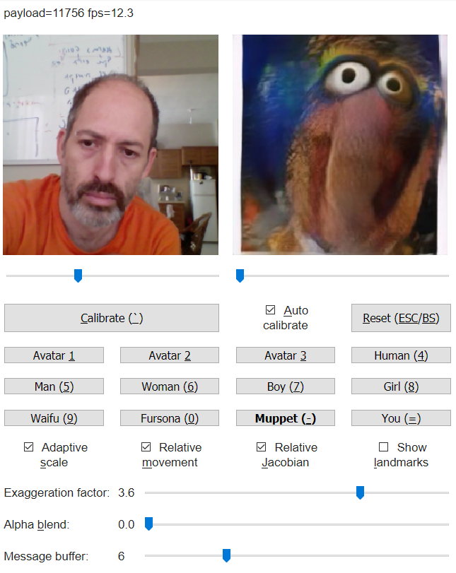

# avatars4all
Live real-time avatars from your webcam in the browser. No special hardware or installation needed. A pure Google Colab implementation for First-order-motion-model and Avatarify. 

### Based on the works: 
1. First Order Motion Model for Image Animation: https://aliaksandrsiarohin.github.io/first-order-model-website 
2. Avatarify: https://github.com/alievk/avatarify 
3. Webcam for Google Colab over Websocket: https://github.com/a2kiti/webCamGoogleColab 

### In this repository you will find: 
1. Colab for live real-time talking head deep-fakes from your webcam. 
2. Colab for creating talking head deep-fakes (VoxCeleb model) from YouTube or other videos. 
3. Colab for creating full body deep-fakes (Tai chi and fashion models) from YouTube or other videos. 

### Features:
1. The fastest purely online solution I am aware of for live real-time first-order-motion-model avatars from your webcam.
2. A new auto-calibration mode that works in real-time!
3. A new exaggeration factor to get those damn muppets to open their mouths!
4. Options to switch between avatars, including newly generated StyleGAN faces, as inspired by Avatarify, of:
- People: https://thispersondoesnotexist.com
- Man, woman, boy, girl: https://fakeface.rest
- Waifus! https://www.thiswaifudoesnotexist.net
- Forsunas! https://thisfursonadoesnotexist.com
- Muppets! https://thismuppetdoesnotexist.com (made especially for this with Doron Adler @norod78)
5. Smart auto-pad/crop/resize to the head or body, for images and for offline videos, tuned for best results.
6. Full control of model parameters as well as zoom and buffering options in the GUI.
7. Upload your own images and videos or pull them from the web including from YouTube, etc., and optionally trim videos.
8. Visualization of facial landmarks and their alignment between source and target.
9. Download videos with original audio and framerate.
10. One click operation with Runtime -> Run all.
 
### Reference implementations:
1. https://colab.research.google.com/github/AliaksandrSiarohin/first-order-model/blob/master/demo.ipynb 
2. https://colab.research.google.com/github/tg-bomze/Face-Image-Motion-Model/blob/master/Face_Image_Motion_Model_(Photo_2_Video)_Eng.ipynb 
3. https://colab.research.google.com/github/alievk/avatarify/blob/master/avatarify.ipynb 
4. https://colab.research.google.com/github/a2kiti/webCamGoogleColab/blob/master/webCamGoogleColab_websocketVersion.ipynb 
5. https://colab.research.google.com/github/thefonseca/colabrtc/blob/master/examples/colabrtc.ipynb 
6. https://github.com/l4rz/first-order-model/tree/master/webrtc 
7. https://gist.github.com/myagues/aac0c597f8ad0fa7ebe7d017b0c5603b
